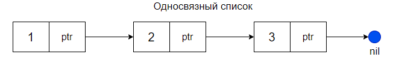
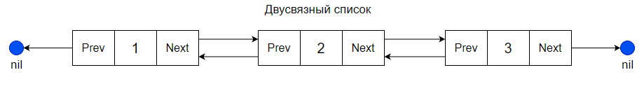

# Связный список

Связный список — структура данных, состоящая из узлов, содержащих данные и ссылки на следующий и/или предыдущий узел списка.

## Структура односвязного списка:

    

## Структура двусвязного списка:

    

